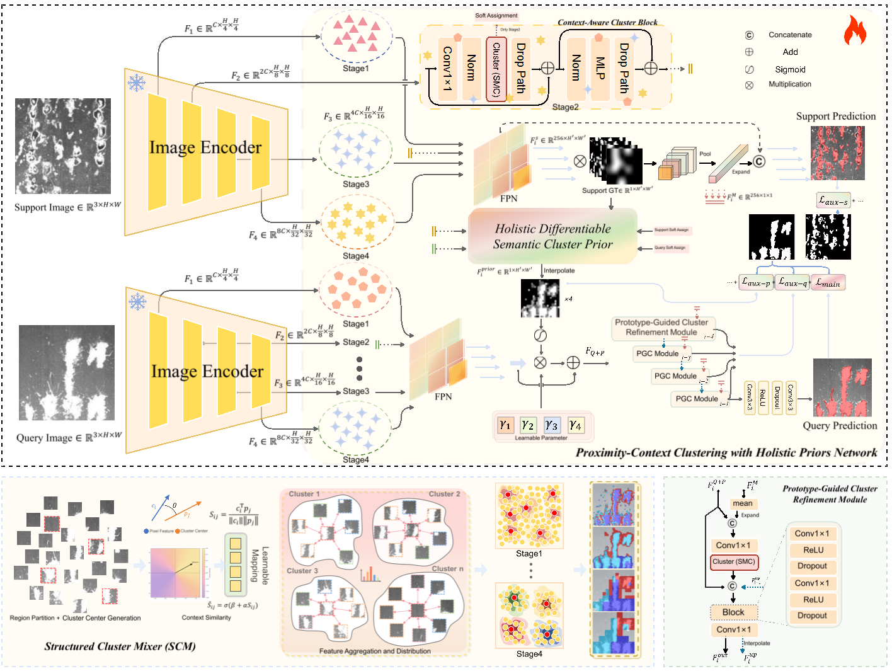
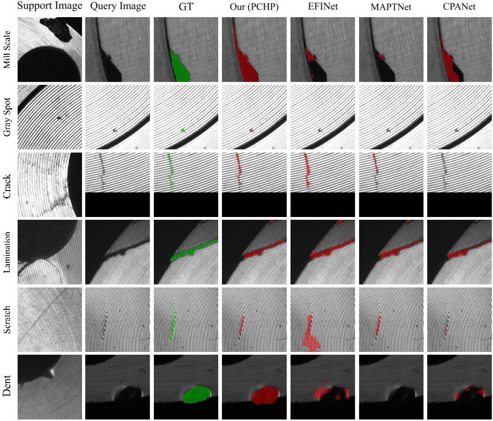

# Context-Aware-Few-Shot-Industrial-Defect-Segmentation-PCHP-
A few-shot industrial defect segmentation framework using context-aware clustering and holistic semantic priors for robust support–query interaction.
This repository provides testing programs and results on FSSD, as well as partial images of FLA-FSS. All programs will be fully disclosed after the publication of the paper.
### Network Architecture

<div align="center">
  
  <br>
  <em>Figure 1: Overall framework of the proposed PCHP method.</em>
</div>

### Quantitative Results on FSSD-12

<div align="center">
  
  <br>
  <em>Table 1: Comparison with state-of-the-art few-shot segmentation methods on FSSD-12 dataset.</em>
</div>

## Dataset

### FLA-FSS Dataset

We introduce the **FLA-FSS (Few-Shot Learning for Automated Factory Surface Segmentation)** dataset, a industrial flange defect segmentation benchmark collected from real manufacturing environments.

> **⚠️ Data Confidentiality Notice:** This paper is currently under review. To ensure the confidentiality and security of the proprietary manufacturing data, the complete FLA-FSS dataset is temporarily withheld from public release. The following samples are provided solely for visual illustration purposes.

### Sample Visualization

<div align="center">
  
  <br>
  <em>Figure 4: Representative samples from the FLA-FSS dataset. Each row shows: (a) original surface image, (b) defect region, and (c) pixel-level annotation mask.</em>
</div>


## Downloads

| Resource | Description | Link |
|----------|-------------|------|
| Pre-trained Weights & Dataset | ResNet-50 init, FSSD-FLA weights, FSSD-12 dataset | [Baidu Netdisk](https://pan.baidu.com/s/1HZLAkG-krvDtPuB7bra9FA) (提取码: `qmh6`) |


# Reviewer Execution Guide

This repository is prepared for anonymous review with the model implementation
distributed as a precompiled Python wheel.

## Files reviewers need

- `dist/pchp_private_model-*.whl`
- `test.py`
- `requirements.txt`
- `config/`
- `data_list/`
- `FSSD-12/`
- `util/`
- `initmodel/resnet50_v2.pth`
- `exp/FSSD_FLA_weight/resnet_fold0_1shot_best_by_class_epoch_101_class0.718550_fb0.843403.pth`
- `scripts/setup.sh`
- `scripts/run_test.sh`

The private model source files under `model/*.py` are intentionally excluded
from the public review repository.

## Run

```bash
bash scripts/setup.sh
bash scripts/run_test.sh
```

The setup script requires a Python build with SSL support because pip downloads
packages over HTTPS. A Conda environment is recommended:

```bash
conda create -n pchp_review python=3.9 openssl pip -y
conda activate pchp_review
bash scripts/setup.sh
```

By default, `run_test.sh` uses:

```text
config/SSD/fold0_resnet50_test.yaml
```


## For the author

Build the private wheel before publishing the review repository:

```bash
bash scripts/build_private_wheel.sh
bash scripts/make_review_release.sh
```

Then commit or upload the generated `review_release/` directory. Make sure
`dist/pchp_private_model-*.whl` is included.

Note: `.pyc` wheels hide source code from normal repository browsing, but they
are not cryptographic protection. For stronger protection, compile the model
with Cython/Nuitka or use a Docker/API-based review package.
